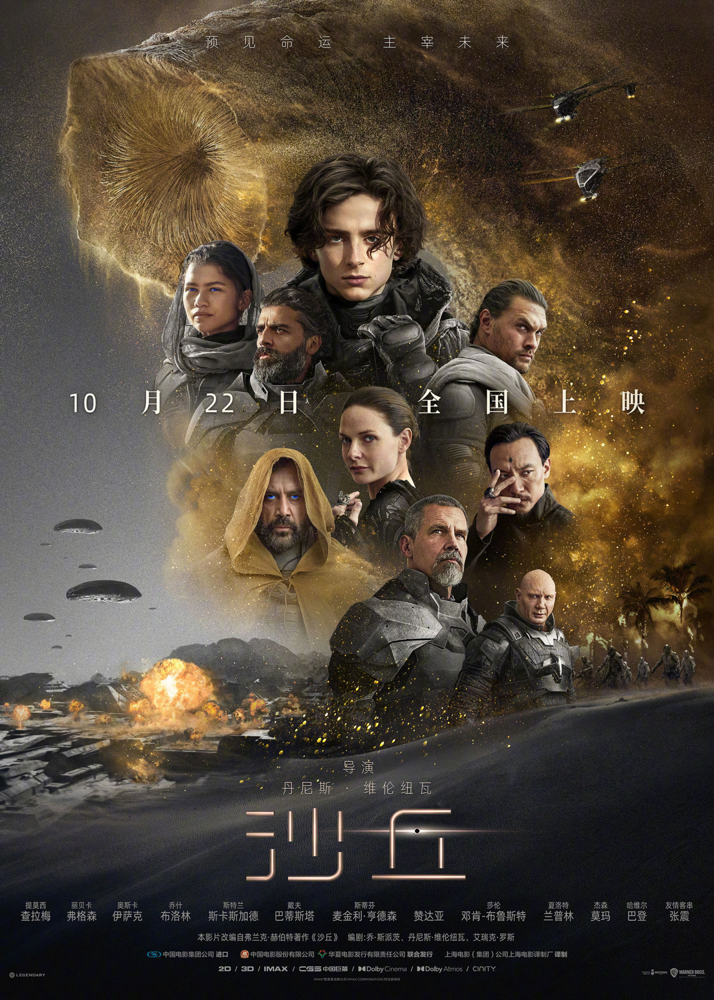
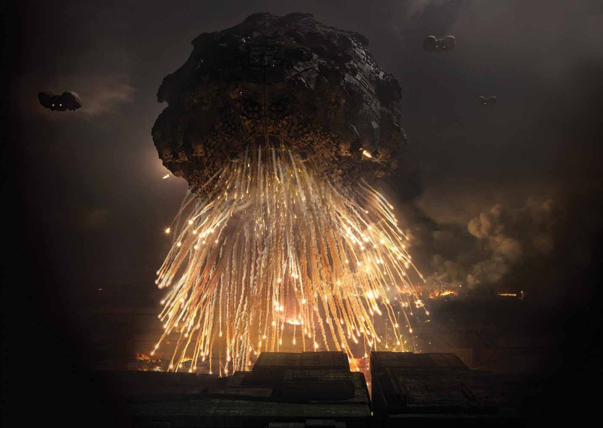

```  
 import java.io.*;
 import java.util.*;

   public class  Printout{    
      public static void main (String [] args){ 
      
        System.out.println("Dune, 2021");
      
      }
    }

```



[Source of Description ](https://en.wikipedia.org/wiki/Dune_(2021_film))

# In the distant future,

**Duke Leto of House Atreides**, ruler of the ocean planet *Caladan*, is assigned by the **Padishah Emperor Shaddam IV** of *House Corrino* to replace *House Harkonnen* as the fiefholder of *Arrakis*, a harsh desert planet and the only source of "***spice***", a valuable psychotropic drug that imparts heightened vitality and awareness to its users. It is critical for faster-than-light interstellar travel, as it grants **Spacing Guild Navigators** the limited prescience needed for safe navigation. Shaddam intends to have *House Harkonnen* retake the planet with the secret aid of his *Sardaukar* troops, eradicating *House Atreides*, whose spreading influence he considers a threat to his power. Leto is reluctant, but sees the advantages of controlling *Arrakis* and forming an alliance with its native population, skilled fighters known as the *Fremen*.

Leto's concubine, **Lady Jessica**, is an acolyte of the *Bene Gesserit*, an exclusive sisterhood whose members possess advanced physical and mental abilities. As part of their centuries-long breeding program, they instructed her to bear a daughter whose son would become the ***Kwisatz Haderach***, a *Bene Gesserit* and messianic superbeing with the clairvoyance necessary to guide humanity to a better future. However, she disobeyed and bore a son, **Paul**. Throughout his life he is trained by Leto's aides, **Duncan Idaho**, **Gurney Halleck**, **Suk doctor Wellington Yueh**, and the **Mentat Thufir Hawat**, while Jessica teaches him *Bene Gesserit* disciplines. Paul confides in Jessica and Duncan that he is troubled by visions of the future. In response, the **Reverend Mother** and **Imperial Truthsayer Gaius Helen Mohiam** visits *Caladan* and subjects him to a death-alternative test to assess his humanity and impulse control, which he passes. Mohiam insists that **Baron Vladimir Harkonnen** spare Paul and Jessica during his coup, to which he duplicitously agrees.

*House Atreides* arrives at *Arrakeen*, the fortress stronghold on *Arrakis*, where Duncan's advance party learned about the planet and *Fremen*. The natives revere Paul and Jessica, which Jessica explains is due to the *Bene Gesserit* sowing beliefs on the planet centuries earlier. Leto negotiates with the Fremen's chieftain, **Stilgar**, and meets planetologist and **Imperial Judge of the Change Dr. Liet-Kynes**, known outside the Fremen as **Dr. Kynes**. Kynes informs Leto, Paul, and Halleck of the dangers of ***spice*** harvesting, including giant sandworms which travel under the desert. During a flight, they spot a *sandworm* approaching a ***spice*** harvester with a stranded crew, whom they successfully rescue. However, Paul's exposure to the ***spice*** outside triggers intense premonitions.

After a failed attempt to assassinate Paul, Leto places his soldiers on high alert. Yueh disables *Arrakeen*'s shields and allows *Harkonnen* and *Sardaukar* troops to invade *Arrakeen*. He incapacitates Leto and tells him he made a deal to deliver him to Baron Harkonnen in exchange for freeing his captive wife. Yueh replaces one of Leto's teeth with a poison gas capsule and is killed after delivering Leto to the Baron, who already had Yueh's wife dissected anyway. Leto releases the gas, killing himself and everyone inside, although the Baron survives but is wounded. Duncan manages to escape. *Harkonnens* capture Paul and Jessica, though the latter kills their captors using a *Bene Gesserit* skill known as *"the Voice"*, a means of controlling others verbally. Stranded in the desert, they spend the night in a tent, where Paul has visions of a "holy war" spreading across the universe in his name.

Baron Harkonnen gives command of *Arrakis* to his nephew, **Rabban**, and orders him to restart ***spice*** production to recover his costs. Paul and Jessica are found by Duncan and Kynes. They head to an old research station, but are found by the *Sardaukar*. Paul discloses his plan to marry one of Shaddam's daughters to avert the civil war that would ensue from news of the Emperor's treachery. Duncan sacrifices himself to enable them to escape. They separate, but Kynes is caught and stabbed by Imperial troops, so she summons a *sandworm* that devours them all. In the deep desert, Paul and Jessica encounter Stilgar's tribe, including **Chani**, the girl in Paul's visions. *Fremen* warrior **Jamis** challenges Stilgar's lenience to them and challenges Paul to a ritual duel to the death; Paul wins. Against Jessica's wishes, Paul joins the *Fremen* to fulfill his father's goal of bringing peace to Arrakis. 


[Fun Dune game I used to play.](https://www.pcgamer.com/celebrating-dune-2000-westwoods-forgotten-rts/)

[Everybody loves books!](https://dunenovels.com/)


